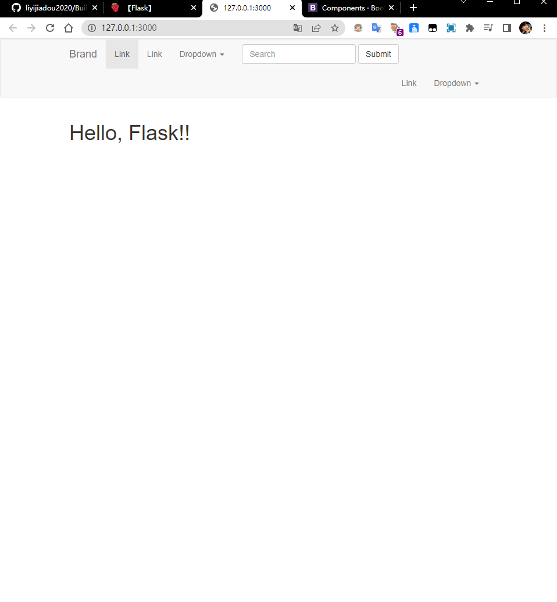

Build-A-Webserver-For-Deploy-Deep-Learning-Network-Model

# Flask学习

**1 - Flask 的简介**
- 少代码量
- 简单，只包含最基础的需要的东西
- 插件很丰富

****2 - 第一个 Hello World 程序****
```python
from flask import Flask

app = Flask(__name__)

@app.route('/')
def index():
    return "Hello, FLASK!!!"

if __name__=='__main__':
    # app.run() # 如果修改了文件，需要重新启动server
    # app.run(debug=True) # 修改文件不需要重启server也可以反映出代码的变化
    app.run(debug=True, host="0.0.0.0", port=3000)
```

****3 - 利用 render_template 渲染界面****

****4 - 利用循环和判断语句控制 template 的渲染****

判断：

```python

  <title>{{ title }}</title>

  <title>DEFULT FLASK TITLE</title>

```

循环：

```python

	<p>{{ p }}</p>

```

****5 - 模板继承和引用****

网页经常会有共用的部分，可以抽取出来作为一个模板。

可以利用模板的基础来实现。

继承：``

引用：``

****6 - 利用 flask bootstrap 来优化布局****

****flask bootstrap 是一个插件，是用于优化页面布局的。****
result:

---

### 实战：用Flask开发一个比较大的博客网站

****7 - Flask-SQLAlchemy 简介和创建用户模型****

